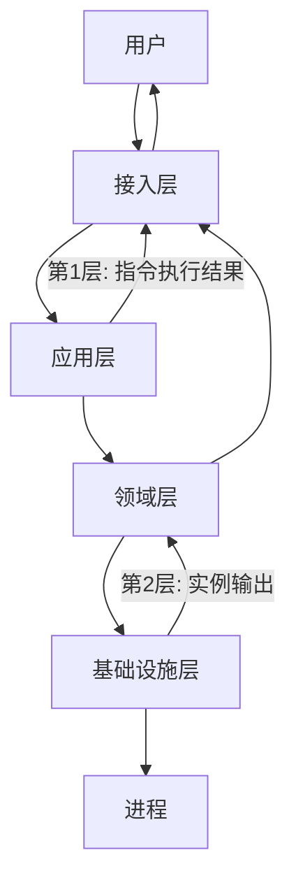
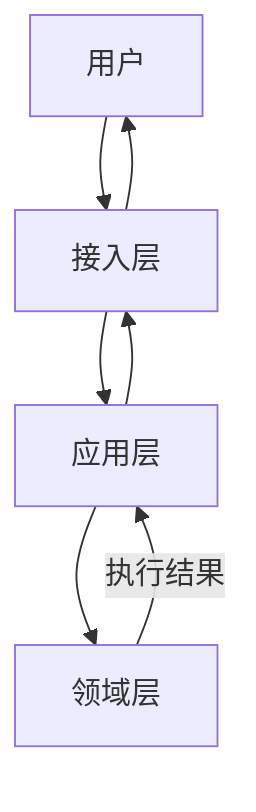

# 移动端聊天控制多类型实例系统 —— 架构设计文档

## 1. 数据流向概览（从用户视角理解系统）

**分层定义**：

| 层 | 职责 | 示例 |
|:---|:---|:---|
| **接入层** | 对接外部平台，负责消息收发和格式转换 | 飞书适配器、微信适配器 |
| **应用层** | 解析指令、分发路由、协调各层完成业务流程 | 指令解析器、指令处理器 |
| **领域层** | 核心业务逻辑，管理实例生命周期和状态 | InstanceManager、Instance |
| **基础设施层** | 与外部资源交互，如进程管理、文件系统 | ProcessRunner |

### 1.1 场景详解

#### 创建实例 `/new`（交互类）

| 阶段 | 分层 | 响应内容 |
|:---|:---|:---|
| 第1层-成功 | 应用层 → 接入层 | 返回创建成功消息：`实例创建成功 [ID:1] @qoder-ai/qodercli \| 代码助手` |
| 第1层-失败 | 应用层 → 接入层 | 格式错误/类型不支持等，直接返回错误提示，无第2层 |
| 第2层 | 基础设施层 → 领域层 → 接入层 | 仅第1层成功后触发，返回实例初始输出，分块发送，最后一块标记`[完成]` |

#### 发送消息 `/<ID> 内容`（交互类）

| 阶段 | 分层 | 响应内容 |
|:---|:---|:---|
| 第1层-成功 | 应用层 → 接入层 | 返回发送成功消息：`消息已发送至实例 [ID:1]` |
| 第1层-失败 | 应用层 → 接入层 | ID不存在/实例忙碌/非交互式等，直接返回错误提示，无第2层 |
| 第2层 | 基础设施层 → 领域层 → 接入层 | 仅第1层成功后触发，返回实例输出，按chunkSize分块，带序号`[1]``[2]`...，最后一块标记`[完成]` |

#### 纯文本消息（交互类）

| 阶段 | 分层 | 响应内容 |
|:---|:---|:---|
| 第1层-成功 | 应用层 → 接入层 | 发送给默认实例，返回发送成功消息 |
| 第1层-失败 | 应用层 → 接入层 | 未设置默认实例/默认实例已失效等，直接返回错误提示，无第2层 |
| 第2层 | 基础设施层 → 领域层 → 接入层 | 仅第1层成功后触发，同`/<ID> 内容`，返回实例输出 |

#### 中断实例 `/interrupt`（交互类）

| 阶段 | 分层 | 响应内容 |
|:---|:---|:---|
| 第1层-成功 | 应用层 → 接入层 | 返回中断发送消息：`中断信号已发送至实例 [ID:1]` |
| 第1层-失败 | 应用层 → 接入层 | ID不存在/实例不支持中断/未设置默认实例等，直接返回错误提示，无第2层 |
| 第2层 | 基础设施层 → 领域层 → 接入层 | 仅第1层成功后触发，返回实例中断后的输出，分块发送，最后一块标记`[完成]` |

> 注：中断的具体实现方式由各实例类型自行控制（如Ctrl+C、特定命令等）

#### 帮助查询 `/help`（管理类）

| 场景 | 分层 | 响应内容 |
|:---|:---|:---|
| `/help` | 应用层 → 接入层 | 返回所有指令列表 |
| `/help <已知指令>` | 应用层 → 接入层 | 返回指定指令详细说明 |
| `/help <未知指令>` | 应用层 → 接入层 | 错误：`未知指令：xxx。使用 /help 查看所有指令` |
| `/help new` | 应用层 → 领域层 → 应用层 → 接入层 | 领域层返回支持的类型列表，应用层格式化后返回 /new 指令说明 |
| `/help new <已知类型>` | 应用层 → 领域层 → 应用层 → 接入层 | 领域层返回类型定义，应用层格式化后返回参数说明和使用示例 |
| `/help new <未知类型>` | 应用层 → 领域层 → 应用层 → 接入层 | 领域层返回类型不存在+支持列表，应用层格式化错误提示 |

#### 列出实例 `/list`（管理类）

| 分层 | 响应内容 |
|:---|:---|
| 应用层 → 领域层 → 应用层 → 接入层 | 有实例：`[ID:1] @qoder-ai/qodercli \| 代码助手 \| 空闲 \| 不可中断 \| 运行5分钟` |
| 应用层 → 领域层 → 应用层 → 接入层 | 无实例：`暂无运行中的实例` |

#### 查看日志 `/log`（管理类）

| 分层 | 响应内容 |
|:---|:---|
| 应用层 → 领域层 → 应用层 → 接入层 | 有记录：`[ID:1] @qoder-ai/qodercli \| 代码助手 \| 2026-03-05 14:30:25 \| 正常结束` |
| 应用层 → 领域层 → 应用层 → 接入层 | 无记录：`暂无已退出实例记录` |

#### 修改备注 `/rename`（管理类）

| 分层 | 响应内容 |
|:---|:---|
| 应用层 → 领域层 → 应用层 → 接入层 | 成功：调用Instance.rename()，返回`实例 [ID:1] 备注已修改为：AI助手` |
| 应用层 → 领域层 → 应用层 → 接入层 | 失败：`实例 [ID:1] 不存在` |

#### 设置默认 `/use`（管理类）

| 分层 | 响应内容 |
|:---|:---|
| 应用层 → 领域层 → 应用层 → 接入层 | 成功：更新默认实例ID，返回`默认实例已设置为 [ID:1] 代码助手` |
| 应用层 → 领域层 → 应用层 → 接入层 | 失败：`实例 [ID:1] 不存在` |

#### 关闭实例 `/kill`（管理类）

| 分层 | 响应内容 |
|:---|:---|
| 应用层 → 领域层 → 应用层 → 接入层 | 成功：调用Instance.kill()终止进程，实例移入日志，返回`实例 [ID:1] 已关闭` |
| 应用层 → 领域层 → 应用层 → 接入层 | 失败：`实例 [ID:1] 不存在` |

#### 批量关闭 `/killall`（管理类）

| 分层 | 响应内容 |
|:---|:---|
| 应用层 → 领域层 → 应用层 → 接入层 | `/killall` 成功：关闭所有实例，返回`已关闭 3 个实例` |
| 应用层 → 领域层 → 应用层 → 接入层 | `/killall` 失败：`暂无运行中的实例` |
| 应用层 → 领域层 → 应用层 → 接入层 | `/killall <类型>` 成功：关闭指定类型实例，返回`已关闭 2 个 @qoder-ai/qodercli 实例` |
| 应用层 → 领域层 → 应用层 → 接入层 | `/killall <类型>` 失败：`暂无运行中的 @qoder-ai/qodercli 实例` |

### 1.2 核心数据流向

从上述场景可以抽象出系统的两种数据流模式：

#### 交互类指令数据流（进入进程）



**适用指令**：`/new`, `/1 内容`, `/interrupt`, 纯文本消息

**两层数据流**：
1. **第1层（应用层 → 用户）**：指令执行结果，同步直接返回
2. **第2层（基础设施层 → 领域层 → 适配器 → 用户）**：实例输出消息，异步回调回流（仅第1层成功后）

#### 管理类指令数据流（不进入进程）



**适用指令**：`/help`, `/list`, `/log`, `/kill`, `/killall`, `/rename`, `/use`

**关键点**：领域层处理完业务逻辑后，将结果返回给应用层，应用层再通过接入层发送给用户

## 2. 分层依赖关系

### 2.1 依赖方向原则

**核心原则：上层依赖下层，领域层依赖基础设施层接口**

```
接入层 → 应用层 → 领域层 → 基础设施层
```

- **基础设施层** 不依赖任何其他层（纯技术实现）
- **领域层** 依赖基础设施层接口（决定何时使用技术能力）
- **应用层** 只依赖领域层（编排领域逻辑）
- **接入层** 调用应用层服务处理请求，同时通过回调机制接收应用层/领域层的结果返回

### 2.2 层间接口定义

| 层 | 对外提供 | 依赖 |
|:---|:---|:---|
| **基础设施层** | `IProcessRunner` 接口、`ProcessRunner` 实现 | 无 |
| **领域层** | `InstanceManager` 类、`Instance` 类 | `IProcessRunner` 接口 |
| **应用层** | `CommandHandler` 接口及实现 | `InstanceManager` |
| **接入层** | 平台适配器（飞书/微信） | `CommandHandler` |

### 2.3 数据流转与依赖对应

**交互类指令（如 `/new`、`/1 内容`）**

```
用户请求
    ↓
接入层（飞书适配器）→ 调用 → 应用层.CommandHandler
    ↓
应用层 → 调用 → 领域层.InstanceManager.createInstance()
    ↓
领域层 → 创建 → Instance → 调用 → 基础设施层.ProcessRunner
    ↓
基础设施层 → 启动进程 → 输出回调 → 领域层.Instance
    ↓
领域层 → 输出处理 → 接入层 → 用户
```

**管理类指令（如 `/list`、`/kill`）**

```
用户请求
    ↓
接入层 → 调用 → 应用层.CommandHandler
    ↓
应用层 → 调用 → 领域层.InstanceManager
    ↓
领域层 → 返回结果 → 应用层 → 接入层 → 用户
```

### 2.4 关键类职责与依赖

| 类/接口 | 所属层 | 职责 | 依赖 |
|:---|:---|:---|:---|
| `IProcessRunner` | 基础设施层 | 定义进程运行接口 | 无 |
| `ProcessRunner` | 基础设施层 | 实际进程启动、输入输出 | 实现 `IProcessRunner` |
| `InstanceManager` | 领域层 | 管理实例生命周期、ID分配 | `IProcessRunner` |
| `Instance` | 领域层 | 维护单个实例状态、处理输出 | `IProcessRunner` |
| `CommandHandler` | 应用层 | 指令解析、参数校验、调用领域层 | `InstanceManager` |
| `FeishuAdapter` | 接入层 | 飞书消息收发、格式转换 | `CommandHandler` |

### 2.5 扩展点设计

**类型扩展**（新增实例类型如 ssh、python）
- 在领域层添加新的 `InstanceType` 定义
- 在基础设施层添加对应的启动参数解析
- 无需修改应用层和接入层

**命令扩展**（新增指令）
- 在应用层实现新的 `CommandHandler`
- 接入层自动路由（通过指令名映射）

**平台扩展**（新增微信、钉钉等）
- 在接入层实现新的平台适配器
- 复用应用层 `CommandHandler`

---
