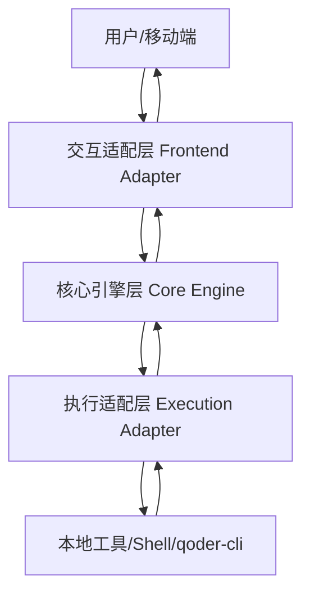

# 架构文档：通用移动端远程交互系统

## 1. 系统概述
本系统旨在构建一个通用的远程交互通道，允许用户通过移动端聊天软件（如飞书、微信等）远程操控 PC 端的各种工具或执行指令。系统采用**抽象分层与插件化架构**，确保交互端（Frontend）与执行端（Backend）的高度可扩展性。

## 2. 逻辑架构
系统由交互适配层、核心引擎层和执行适配层组成，确保业务逻辑与具体平台实现解耦。

### 2.1 交互适配层 (Frontend Adapter)
- **职责**：
  - 对接具体聊天平台 API（如飞书机器人 SDK）。
  - 接收原始消息并解包。
  - 将平台特定的消息格式转换为 `UnifiedMessage` 标准协议。
  - 处理平台特定的交互增强（如回复消息路由）。

### 2.2 核心引擎层 (Core Engine)
- **职责**：
  - **身份验证中心**：基于 `UserID` 的白名单校验，执行“认人不认群”策略。
  - **智能路由器**：根据 `ContextID` 和指令内容（别名/默认路由）将指令精准分发至对应实例。
  - **会话管理器**：维护 Session 实例的生命周期，负责**心跳监控与循环预警**。
    - **状态判定**：识别闲置状态并触发周期性提醒逻辑，支持“提醒并等待用户决策”模式。
    - **资源止损**：管理闲置计数器，在达到 3 次预警无果后立即执行强制清理，释放 PC 资源。
  - **任务看板**：管理活跃任务清单，支持 `/list` 指令的全局状态检索。
  - **反馈聚合器**：对执行端的输出进行分片处理、符号化增强（Emoji 状态标示）并按序回传。

### 2.3 执行适配层 (Execution Adapter)
- **职责**：
  - **任务分发**：启动 Job（一次性任务）或维护 Session（交互式进程）。
  - **输入映射**：将核心层下发的交互内容路由至目标进程的 `stdin`。
  - **输出捕获**：实时监控进程的 `stdout/stderr`，并携带 `ContextID` 返回给核心层。

## 3. 关键组件接口定义

### 3.1 IMessageGateway (消息网关)
定义前端交互的抽象标准：
- `listen()`: 启动消息监听。
- `send(message: UnifiedMessage)`: 发送结构化消息。
- `format(content: string)`: 适配目标平台的格式化处理（如分片、富文本）。

### 3.2 ITaskExecutor (任务执行器)
定义后端执行的抽象标准：
- `execute(command: string)`: 执行 Job 模式任务。
- `spawn(command: string)`: 启动 Session 模式任务。
- `input(data: string)`: 向活跃会话写入数据。

### 3.3 ICommandProvider (命令提供者适配器)
- 负责将特定工具（如 `qoder-cli`）的指令集适配到系统路由逻辑中。

## 4. 通信协议定义：UnifiedMessage
所有层级间传递的消息必须封装为统一结构：
- `Content`: 原始指令或反馈文本。
- `UserID`: 发起者的唯一身份标识。
- `ContextID`: 会话/群组标识，用于回溯路由。
- `Metadata`: 包含别名 (Alias)、备注 (Remark)、状态 (Status) 等扩展信息。

## 5. 执行模式说明
- **Job 模式**：适用于一次性指令（如 `ls`, `git status`）。执行完毕后实例立即销毁，仅回传最终结果。
- **Session 模式**：适用于持续交互（如 Shell 交互, REPL）。系统维持长连接，后续消息根据路由策略自动作为该进程的输入。

## 6. 安全性与路由策略
- **安全约束**：严格校验 `UserID`。非白名单用户指令静默处理，群聊场景下仅响应授权用户的指令。
- **智能路由**：
  - 显式路由：通过 `别名: 指令` 指定目标。
  - 隐式路由：引用/回复消息自动关联 Context。
  - 兜底路由：默认发送至最后活跃的实例。
- **异常处理**：所有关键节点（送达、开始、异常、结束）需有即时反馈，异常反馈优先使用富文本卡片或警示符号。
