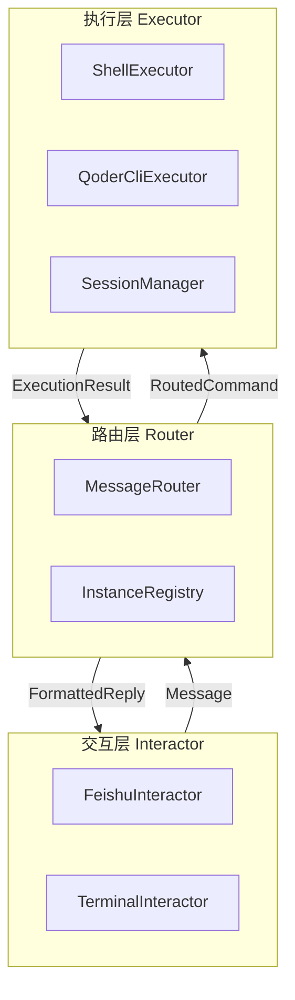
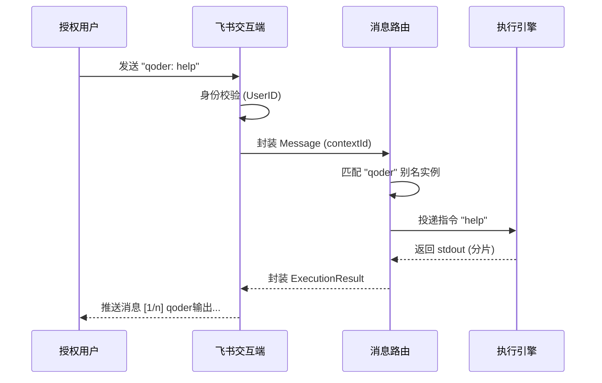

# 远程交互系统架构文档

## 1. 架构概述

本项目旨在构建一个通用的移动端远程交互系统，支持通过聊天软件（如飞书）远程操控 PC 端工具。架构采用 **分层解耦** 和 **数据驱动** 的设计原则，强制使用 **Zod** 进行运行时验证，确保 AI 友好和系统稳定性。

### 1.1 系统架构图



## 2. 核心模块说明

### 2.1 交互层 (Interactor Layer)
负责与不同消息平台对接。
- **职责**：
  - 接入平台 Webhook 或 SDK。
  - 身份校验：严格比对 `userId` 是否在白名单。
  - 消息分片：针对平台长度限制，执行自动分片发送。
  - 语义化反馈：将执行结果转换为富文本或带有 Emoji 的消息。

### 2.2 路由层 (Router Layer)
系统的“大脑”，负责精准的消息投递。
- **职责**：
  - **Context 匹配**：根据 `contextId` 将消息路由至对应实例。
  - **指令解析**：识别 `别名: 指令` 或 `/list` 等管理指令。
  - **状态维护**：记录最后活跃实例，实现智能兜底路由。

### 2.3 执行层 (Executor Layer)
负责指令的具体执行与生命周期管理。
- **职责**：
  - **Job 模式**：一次性任务（如 `ls`），执行完即销毁。
  - **Session 模式**：持续交互任务（如 `qoder-cli`），维持 stdin/stdout 流。
  - **资源回收**：监控实例超时，自动清理非活跃 Session。

## 3. 数据契约 (Single Source of Truth)

系统强制使用 Zod 定义数据模型，所有外部输入必须通过以下 Schema 验证。

```typescript
import { z } from 'zod';

// 1. 消息平台
export const PlatformSchema = z.enum(['feishu', 'terminal']);

// 2. 核心消息模型
export const MessageSchema = z.object({
  content: z.string().describe('消息文本内容'),
  userId: z.string().describe('授权用户唯一标识'),
  contextId: z.string().describe('会话或群组标识'),
  platform: PlatformSchema,
  replyTo: z.string().optional().describe('被回复的消息 ID'),
});

// 3. 执行状态与结果
export const ExecutionStatusSchema = z.enum(['PENDING', 'RUNNING', 'SUCCESS', 'FAILED']);
export const ExecutionResultSchema = z.object({
  contextId: z.string(),
  content: z.string(),
  status: ExecutionStatusSchema,
  chunkIndex: z.number().default(0),
  isFinal: z.boolean().default(true),
  alias: z.string(),
});

// 4. 实例信息
export const InstanceInfoSchema = z.object({
  alias: z.string(),
  type: z.enum(['JOB', 'SESSION']),
  lastActiveAt: z.number(),
  status: ExecutionStatusSchema,
});
```

## 4. 核心逻辑规范

### 4.1 智能路由算法 (MessageRouter)
- **显式路由优先级**：正则匹配 `^([^：:]+)[：:](.*)$`。若 `alias` 存在于活跃清单，则精准投递。
- **状态感知兜底**：若无显式前缀，消息自动路由至 `lastActiveAt` 最晚的活跃实例。
- **身份隔离**：路由前必须校验 `Message.userId` 是否在白名单。

## 4. 核心业务流程

### 4.1 指令下发与回显流程



## 5. 设计约束

1. **原子化逻辑**：每个文件代码量需保持在 200 行以内，逻辑尽量纯粹。
2. **错误处理**：所有 Executor 异常必须捕获并转化为带有 `ExecutionStatus.FAILED` 的结果，携带语义化错误描述。
3. **可验证性**：核心路由逻辑必须具备 Vitest 单元测试覆盖。
